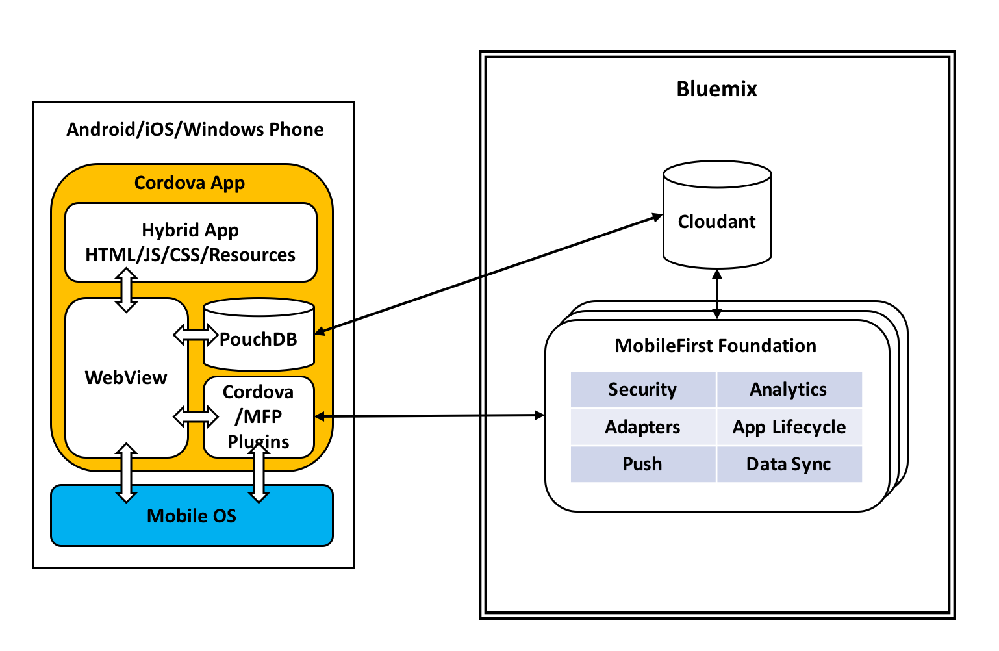
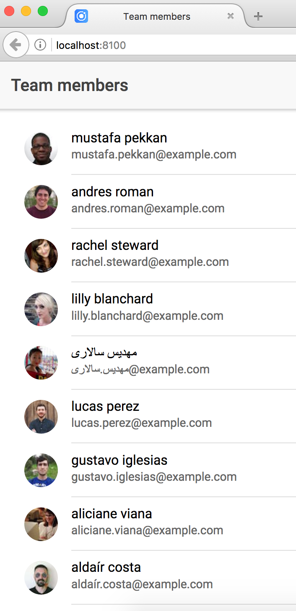
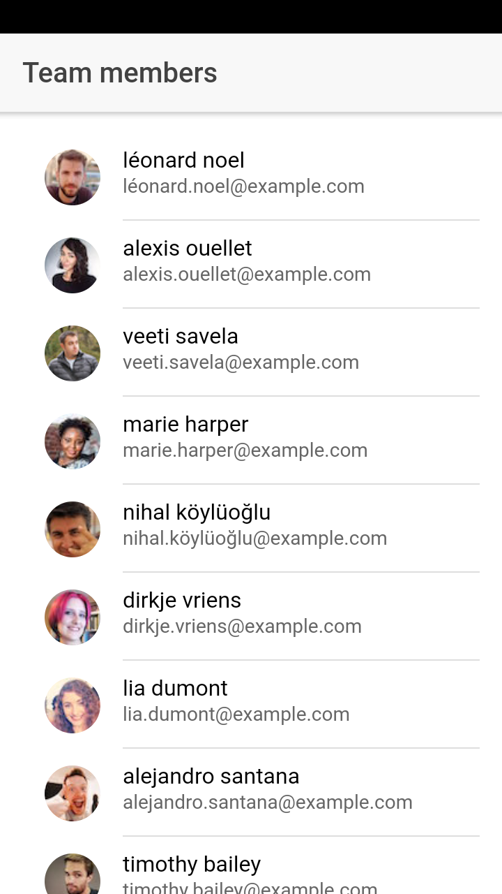
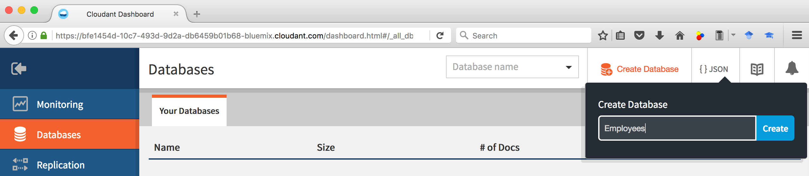
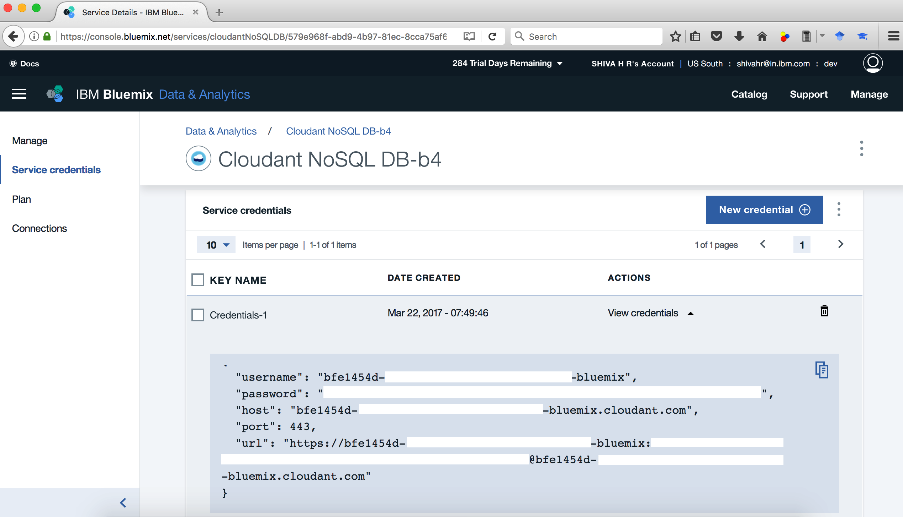
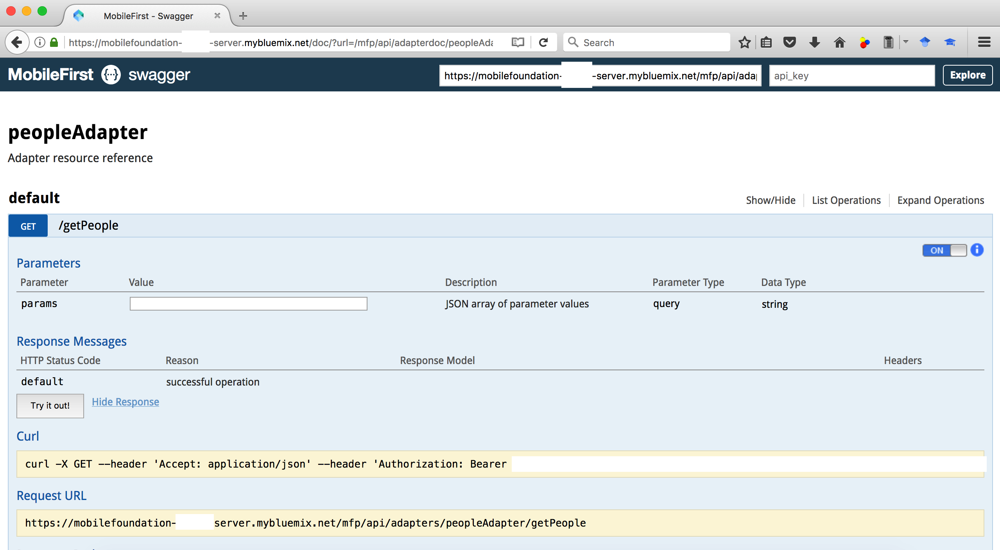
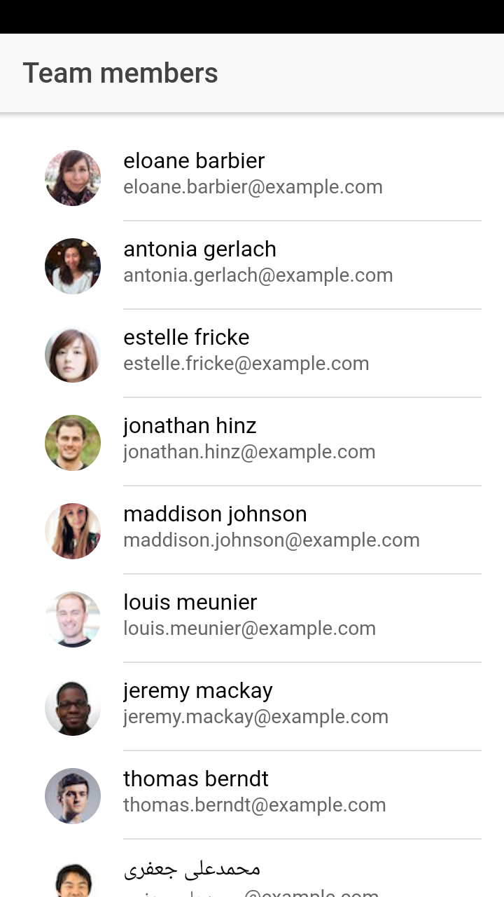

**Note**: This is a work in progress.

# Secure Offline Synchronization through IBM Mobile Foundation

The increasing focus on [Digital Transformation](http://sloanreview.mit.edu/article/the-nine-elements-of-digital-transformation/) has led to more and more use cases where organizations want their enterprise apps to be usable even when the device is offline, and later sync the data with the enterprise when the device comes online again. In addition, organizations want to leverage the benefits of:
  * hybrid mobile apps where a single code base, developed using standard web technologies, works across platforms - Android, iOS and Windows phones, thereby enabling organizations to more easily embrace the policy of [bring your own device (BYOD)](https://en.wikipedia.org/wiki/Bring_your_own_device).
  * cloud hosted mobile backend servers for robust handling of security challenges posed by above scenarios, backend integration, app life cycle management and app analytics.

In this developer journey, we will show you how to combine the following technologies to **securely** implement the mobile offline synchronization use case.
  * [IBM Mobile Foundation](https://www.ibm.com/us-en/marketplace/mobile-cloud-applications) - the enterprise grade mobile backend server available as a service on IBM Cloud,
  * [Ionic framework](https://ionicframework.com/) - an open-source SDK for hybrid mobile app development built on top of [Apache Cordova](https://en.wikipedia.org/wiki/Apache_Cordova) and [Angular](https://en.wikipedia.org/wiki/Angular_(application_platform)),
  * [PouchDB](https://pouchdb.com/) - an open source JavaScript database that is designed to run well within the browser, and
  * [IBM Cloudant](https://www.ibm.com/analytics/us/en/technology/cloud-data-services/cloudant/) - a managed NoSQL JSON database service available on IBM Cloud.

# Flow


1. User launches the mobile app. A call is made to MobileFirst adapter to fetch the Cloudant service credentials stored in the adapter configuration.
2. MobileFirst server sees that the user/device is not yet authenticated, and hence throws a user authentication security challenge back to the mobile app.
3. Mobile app displays the login screen asking the user to specify his/her credentials.
4. User enters his/her login credentials and clicks *Login*.
5. Mobile app sends the user entered credentials to the MobileFirst server as a response to the security challenge.
6. MobileFirst server invokes security adapter logic to validate the user credentials.
7. If user authentication succeeds, MobileFirst server responds to the initial app request with the Cloudant service credentials.
8. Mobile app now sets up automatic sync between local PouchDB and Cloudant NoSQL DB with the server fetched Cloudant service credentials.
9. Every time the local PouchDB syncs its contents with Cloudant, the handleChange method is called which, being enclosed in Angular NgZone, automatically updates the mobile app UI with the latest data.

## Steps
1. [Setup Ionic and MFP CLI](#step-1-setup-ionic-and-mfp-cli)
2. [Create Ionic Sample Application](#step-2-create-ionic-sample-application)
  - 2.1 [Create a new Ionic project](#21-create-a-new-ionic-project)
  - 2.2 [Start a local dev server for app dev/testing](#22-start-a-local-dev-server-for-app-devtesting)
  - 2.3 [Update application to display a list of people](#23-update-application-to-display-a-list-of-people)
  - 2.4 [Run application on Android phone](#24-run-application-on-android-phone)
3. [Create an Adapter in MobileFirst Server to fetch data from Cloudant database](#step-3-create-an-adapter-in-mobilefirst-server-to-fetch-data-from-cloudant-database)
  - 3.1 [Create Cloudant database and populate with people data](#31-create-cloudant-database-and-populate-with-people-data)
  - 3.2 [Create Bluemix Mobile Foundation service and configure MFP CLI](#32-create-bluemix-mobile-foundation-service-and-configure-mfp-cli)
  - 3.3 [Create an MFP adapter to query people data](#33-create-an-mfp-adapter-to-query-people-data)
4. [Update Ionic app to fetch data from MobileFirst Adapter](#step-4-update-ionic-app-to-fetch-data-from-mobilefirst-adapter)
  - 4.1 [Add Cordova plugin for MFP](#41-add-cordova-plugin-for-mfp)
  - 4.2 [Register the app to MobileFirst Server](#42-register-the-app-to-mobilefirst-server)
  - 4.3 [Wait for MobileFirst SDK to load before showing UI](#43-wait-for-mobilefirst-sdk-to-load-before-showing-ui)
  - 4.4 [Call MobileFirst Adapter to load people data from Cloudant](#44-call-mobilefirst-adapter-to-load-people-data-from-cloudant)
5. [PouchDB Cloudant Offline Sync](#step-5-pouchdb-cloudant-offline-sync)
  - 5.1 [Add adapter function to return Cloudant credentials](#51-add-adapter-function-to-return-cloudant-credentials)
  - 5.2 [Add code to setup sync between PouchDB and Cloudant](#52-add-code-to-setup-sync-between-pouchdb-and-cloudant)
6. [Add pre-emptive login](#step-6-add-pre-emptive-login)
  - 6.1 [Add Security Adapter](#61-add-security-adapter)
  - 6.2 [Secure peopleAdapter using UserLogin security check](#62-secure-peopleadapter-using-userlogin-security-check)
  - 6.3 [Create a new provider to assist in handling MFP security challenges](#63-create-a-new-provider-to-assist-in-handling-mfp-security-challenges)
  - 6.4 [Create login page](#64-create-login-page)
7. [Support Offline Login](#step-7-support-offline-login)
  - 7.1 [Save authenticated credentials in JSONStore and use it for offline login](#71-save-authenticated-credentials-in-jsonstore-and-use-it-for-offline-login)
  - 7.2 [Update login page to call JSONStore based login when device is offline](#72-update-login-page-to-call-jsonstore-based-login-when-device-is-offline)

[Troubleshooting](#troubleshooting)

## Step 1. Setup Ionic and MFP CLI
* Install Node.js by downloading the setup from https://nodejs.org/en/ (Node.js 6.x or above)
```
$ node --version
v8.6.0
```

* Install Cordova
```
$ sudo npm install -g cordova
$ cordova --version
7.0.1
```

* Install Ionic
```
$ sudo npm install -g ionic
$ ionic --version
3.12.0
```

* Install IBM MobileFirst Platform CLI
```
$ sudo npm install -g mfpdev-cli
$ mfpdev --version
8.0.0-2017091111
```

* Install GIT https://git-scm.com/downloads
```
$ git --version
git version 2.9.3 ...
```

* Install Maven:
```
$ /usr/bin/ruby -e "$(curl -fsSL https://raw.githubusercontent.com/Homebrew/install/master/install)"
$ brew install maven
$ mvn --version
Apache Maven 3.5.0 ...
```

* Install Java SDK
```
$ java -version
java version "1.8.0_101"
```

* Install Atom (IDE for JavaScript)

  Install TypeScript plugin for Atom
```
apm install atom-typescript
```

Note: If you are on Windows, instead of using sudo, run the above commands in a command prompt opened in administrative mode.

## Step 2. Create Ionic Sample Application

Ionic quick tutorials:
* 10 Minutes with Ionic 2: Hello World http://blog.ionic.io/10-minutes-with-ionic-2-hello-world/
* 10 Minutes with Ionic 2: Adding Pages and Navigation http://blog.ionic.io/10-minutes-with-ionic-2-adding-pages-and-navigation/
* 10 Minutes with Ionic 2: Calling an API http://blog.ionic.io/10-minutes-with-ionic-2-calling-an-api/
* 10 Minutes with Ionic 2: Using the Camera with Ionic Native http://blog.ionic.io/10-minutes-with-ionic-2-using-the-camera-with-ionic-native/

### 2.1 Create a new Ionic project

Create a new Ionic project with blank starter template
```
$ ionic start MobileFirst-Ionic-GettingStarted blank
✔ Creating directory ./MobileFirst-Ionic-GettingStarted - done!
[INFO] Fetching app base (https://github.com/ionic-team/ionic2-app-base/archive/master.tar.gz)
✔ Downloading - done!
[INFO] Fetching starter template blank 
       (https://github.com/ionic-team/ionic2-starter-blank/archive/master.tar.gz)
✔ Downloading - done!
✔ Updating package.json with app details - done!
✔ Creating configuration file ionic.config.json - done!
[INFO] Installing dependencies may take several minutes!
> npm install
✔ Running command - done!
> git init

? Connect this app to the Ionic Dashboard? No
> git add -A
> git commit -m "Initial commit" --no-gpg-sign

Next Steps:
Go to your newly created project: cd ./MobileFirst-Ionic-GettingStarted
$
```

Change directory to the newly created project:
```
$ cd MobileFirst-Ionic-GettingStarted
```

### 2.2 Start a local dev server for app dev/testing

To get a preview of the application, Ionic/Cordova provides a feature by the which the application can be launched in a browser by using the `cordova serve` or `ionic serve` as shown below:
```
$ ionic serve
[INFO] Starting app-scripts server: --address 0.0.0.0 --port 8100 
       --livereload-port 35729 --dev-logger-port 53703 - Ctrl+C to cancel
[17:20:10]  watch started ... 
[17:20:10]  build dev started ... 
[17:20:10]  clean started ... 
[17:20:10]  clean finished in 1 ms 
[17:20:10]  copy started ... 
[17:20:10]  deeplinks started ... 
[17:20:10]  deeplinks finished in 22 ms 
[17:20:10]  transpile started ... 
[17:20:13]  transpile finished in 3.58 s 
[17:20:13]  preprocess started ... 
[17:20:14]  copy finished in 3.83 s 
[17:20:14]  preprocess finished in 185 ms 
[17:20:14]  webpack started ... 
[17:20:21]  webpack finished in 7.48 s 
[17:20:21]  sass started ... 
[17:20:22]  sass finished in 1.01 s 
[17:20:22]  postprocess started ... 
[17:20:22]  postprocess finished in 5 ms 
[17:20:22]  lint started ... 
[17:20:22]  build dev finished in 12.36 s 
[17:20:22]  watch ready in 12.42 s 
[17:20:22]  dev server running: http://localhost:8100/ 

[INFO] Development server running!
       Local: http://localhost:8100
       External: http://192.xxx.xxx.xxx:8100, http://9.xxx.xxx.xxx:8100
```

The above command also launches the Cordova [live-reload](https://www.npmjs.com/package/cordova-plugin-browsersync) workflow. The live-reload feature watches for changes in your source files and automatically builds the project and reloads the application in browser.

Since the `ionic serve` command continues to run in foreground, to be able to run any further Cordova/Ionic commands open a new terminal and change directory to the project.

### 2.3 Update application to display a list of people 

Let us update the application to [display a list of people](http://blog.ionic.io/10-minutes-with-ionic-2-calling-an-api/) by fetching data from say https://randomuser.me/api/

#### 2.3.1 Create a new Provider

```
$ ionic generate provider PeopleService
[OK] Generated a provider named PeopleService!
```

The above command will generate an `@Injectable` class called `PeopleServiceProvider` in `src/providers/people-service/people-service.ts`

#### 2.3.2 Add code in provider to get people data from https://randomuser.me/api/

Update `src/providers/people-service/people-service.ts` as below:

<pre><code>
import { Injectable } from '@angular/core';
import { Http } from '@angular/http';
import 'rxjs/add/operator/map';

@Injectable()
export class PeopleServiceProvider {
<b>  data: any = null;</b>

  constructor(public http: Http) {
  }

<b>  load() {
    if (this.data) {
      // already loaded data
      return Promise.resolve(this.data);
    }

    // don't have the data yet
    return new Promise(resolve => {
      // We're using Angular HTTP provider to request the data,
      // then on the response, it'll map the JSON data to a parsed JS object.
      // Next, we process the data and resolve the promise with the new data.
      this.http.get('https://randomuser.me/api/?results=20')
        .map(res => res.json())
        .subscribe(data => {
          // we've got back the raw data, now generate the core schedule data
          // and save the data for later reference
          this.data = data.results;
          resolve(this.data);
        });
    });
  }
</b>
}
</code></pre>

#### 2.3.3 Add the PeopleServiceProvider and HttpModule to your app.module.ts

Add the PeopleServiceProvider and HttpModule to your `src/app/app.module.ts` as shown below:

<pre><code>
import { BrowserModule } from '@angular/platform-browser';
import { ErrorHandler, NgModule } from '@angular/core';
<b>import { HttpModule } from '@angular/http';
import { PeopleServiceProvider } from '../providers/people-service/people-service';</b>
...
@NgModule({
  ...
  imports: [
    BrowserModule,
    <b>HttpModule,</b>
    IonicModule.forRoot(MyApp)
  ],
  ...
  providers: [
    StatusBar,
    SplashScreen,
    {provide: ErrorHandler, useClass: IonicErrorHandler}<b>,
    PeopleServiceProvider</b>
  ]
})
export class AppModule {}
</code></pre>

#### 2.3.4 Modify home page to display the list of people

  - Update `src/pages/home/home.ts` as below:

<pre><code>
import { Component } from '@angular/core';
import { NavController } from 'ionic-angular';
<b>import { PeopleServiceProvider } from '../../providers/people-service/people-service';</b>

@Component({
  selector: 'page-home',
  templateUrl: 'home.html'
})
export class HomePage {
  <b>people: any;</b>

  constructor(public navCtrl: NavController<b>, public peopleServiceProvider: PeopleServiceProvider</b>) {
    <b>console.log('--> HomePage constructor() called');
    this.peopleServiceProvider.load().then(data => {
      this.people = data;
    });</b>
  }

  <b>ionViewDidLoad() {
    console.log('--> HomePage ionViewDidLoad() called');
  }</b>

}
</code></pre>

  - Update `src/pages/home/home.html` as below:

```
<ion-header>
  <ion-navbar>
    <ion-title>
      Team members
    </ion-title>
  </ion-navbar>
</ion-header>

<ion-content padding>
  <ion-list>
    <ion-item *ngFor="let person of people">
      <ion-avatar item-left>
        
      </ion-avatar>
      <h2>{{person.name.first}} {{person.name.last}}</h2>
      <p>{{person.email}}</p>
    </ion-item>
  </ion-list>
</ion-content>
```

#### 2.3.5 Preview new app

Once you save all the above changes, back in console where `ionic serve` is running, you can see an automatic build being run as shown below:

```
...
[17:20:29]  lint finished in 7.28 s 
[17:27:00]  build started ... 
[17:27:00]  deeplinks update started ... 
[17:27:00]  deeplinks update finished in 9 ms 
[17:27:00]  transpile started ... 
[17:27:03]  transpile finished in 2.26 s 
[17:27:03]  webpack update started ... 
[17:27:04]  webpack update finished in 1.66 s 
[17:27:04]  sass update started ... 
[17:27:08]  sass update finished in 3.30 s 
[17:27:08]  build finished in 7.26 s 
```

The app being previewed in browser is reloaded as shown below:



### 2.4 Run application on Android phone

#### 2.4.1 Install Android Studio and Android SDK platform
* Download and install Android Studio from https://developer.android.com/studio/index.html
* Install Android SDK Platform 23 (or higher)
  - Launch Android Studio.
  - Click on *Configure* -> *SDK Manager*
  - Under *SDK Platforms*, select *Android 6.0 (Marshmallow) API Level 23*. Click *Apply* and then click *OK*. This will install Android SDK Platform on your machine.
 
#### 2.4.2 Enable developer options and USB debugging on your Android phone
* Enable USB debugging on your Android phone as per the steps in https://developer.android.com/studio/debug/dev-options.html
  - Launch the Settings app on your phone. Select *About Device* -> *Software Info* . Tap *Build number* 7 times to enable developer options.
  - Return to Settings list. Select *Developer options* and enable *USB debugging*.
* If you are developing on Windows, then you need to install the appropriate USB driver as per instructions in https://developer.android.com/studio/run/oem-usb.html.
* Connect the Android phone to your development machine by USB cable, and accept *allow* access on your phone.

#### 2.4.3 Enable Android platform for Ionic application

* Add [Cordova platform for Android](https://cordova.apache.org/docs/en/latest/guide/platforms/android/)
```
$ ionic cordova platform add android@6
> cordova platform add android@6 --save
✔ Running command - done!
```

  Note: Make sure the Cordova platform version being added is supported by the MobileFirst plug-ins. Site https://mobilefirstplatform.ibmcloud.com/tutorials/en/foundation/8.0/application-development/sdk/cordova/ lists the supported levels.
```
$ cordova platform version
Installed platforms:
  android 6.3.0
Available platforms: 
  blackberry10 ~3.8.0 (deprecated)
  browser ~4.1.0
  ios ~4.4.0
  osx ~4.0.1
  webos ~3.7.0
```

[Cordova Android 6.3.0](https://cordova.apache.org/announcements/2017/09/27/android-release.html) targets the latest Android API level of API 26. If you want to [target API 23 instead](https://stackoverflow.com/questions/35573485/ionic-add-platform-android-with-custom-android-target), then edit `config.xml` file (at the root of the project) and add preference for `android-targetSdkVersion` as shown below.
```
  <preference name="android-minSdkVersion" value="16" />
  <preference name="android-targetSdkVersion" value="23" />
```

#### 2.4.4 Build/Run the Ionic application on Android phone

* Build Android application
```
$ ionic cordova build android
```

* Run application on Android device
```
$ ionic cordova run android
```



## Step 3. Create an Adapter in MobileFirst Server to fetch data from Cloudant database

### 3.1 Create Cloudant database and populate with people data

* Log in to [Bluemix Dashboard](https://console.bluemix.net/) and create [*Cloudant NoSQL DB*](https://console.bluemix.net/catalog/services/cloudant-nosql-db) service.
* From the welcome page of Cloudant service that you just created, launch the Cloudant Dashboard.
* In the Cloudant dashboard, click on *Databases*.
* Click on *Create Database*. Specify name of database as `employees` as shown below. Click *Create*.



Once the database is created, the dashboard will update to show the documents inside `employees` database (which, as expected, will be empty to begin with).

* Click *Create Document*. Under document content, after the auto populated `_id` field, enter `name`, `email` and `picture` information fetched from https://randomuser.me/api/?results=10 as shown below.

```
{
  "_id": "7fc63023799dfda9582609e75127b4fa",
  "gender": "female",
  "name": {
    "title": "mademoiselle",
    "first": "eloane",
    "last": "barbier"
  },
  "email": "eloane.barbier@example.com",
  "picture": {
    "large": "https://randomuser.me/api/portraits/women/61.jpg",
    "medium": "https://randomuser.me/api/portraits/med/women/61.jpg",
    "thumbnail": "https://randomuser.me/api/portraits/thumb/women/61.jpg"
  }
}
```

Click *Create Document* to create/save the document.

* Repeat the above steps and create documents for the remaining user data.

### 3.2 Create Bluemix Mobile Foundation service and configure MFP CLI
* Log in to [Bluemix Dashboard](https://console.bluemix.net/) and create [*Mobile Foundation*](https://console.bluemix.net/catalog/services/mobile-foundation) service. Make a note of the admin password.

* Back on your local machine, configure MFP CLI to work with Bluemix Mobile Foundation server by running following command in console.

```
$ mfpdev server add
? Enter the name of the new server profile: Bluemix-MFP
? Enter the fully qualified URL of this server: https://mobilefoundation-71-hb-server.mybluemix.net:443
? Enter the MobileFirst Server administrator login ID: admin
? Enter the MobileFirst Server administrator password: **********
? Save the administrator password for this server?: Yes
? Enter the context root of the MobileFirst administration services: mfpadmin
? Enter the MobileFirst Server connection timeout in seconds: 30
? Make this server the default?: No
Verifying server configuration...
The following runtimes are currently installed on this server: mfp
Server profile 'Bluemix-MFP' added successfully.

$ mfpdev server info
Name         URL
--------------------------------------------------------------------------------------
Bluemix-MFP  https://mobilefoundation-71-hb-server.mybluemix.net:443        [Default]
--------------------------------------------------------------------------------------
```

### 3.3 Create an MFP adapter to query people data

#### 3.3.1 Create an MFP adapter of type HTTP

Use MFP CLI to create an MFP adapter of type HTTP as shown below.

```
$ cd ..
$ mfpdev adapter create
? Enter adapter name: peopleAdapter
? Select adapter type: HTTP
? Enter group ID: com.mfp.adapters
Creating http adapter: peopleAdapter...
Successfully created adapter: peopleAdapter
```

Change directory to the newly created adapter source.

#### 3.3.2 Point the created adapter to your Cloudant service instance

Update `src/main/adapter-resources/adapter.xml` as below. Change domain, username and password to point to your Cloudant service:

```
<?xml version="1.0" encoding="UTF-8"?>
<mfp:adapter name="peopleAdapter"
			 xmlns:xsi="http://www.w3.org/2001/XMLSchema-instance"
			 xmlns:mfp="http://www.ibm.com/mfp/integration"
			 xmlns:http="http://www.ibm.com/mfp/integration/http">

  <displayName>peopleAdapter</displayName>
  <description>peopleAdapter</description>
  <connectivity>
    <connectionPolicy xsi:type="http:HTTPConnectionPolicyType">
      <protocol>https</protocol>
      <domain>YourCloudantDomain-bluemix.cloudant.com</domain>
      <port>443</port>
      <connectionTimeoutInMilliseconds>30000</connectionTimeoutInMilliseconds>
      <socketTimeoutInMilliseconds>30000</socketTimeoutInMilliseconds>
      <authentication>
        <basic/>
          <serverIdentity>
            <username>YourCloudantUsername</username>
            <password>YourCloudantPassword</password>
          </serverIdentity>
      </authentication>
      <maxConcurrentConnectionsPerNode>50</maxConcurrentConnectionsPerNode>
    </connectionPolicy>
  </connectivity>
  <procedure name="getPeople"/>
</mfp:adapter>
```

  How to get the domain, username and password for your Cloudant service instance?

  - In Bluemix Dashboard, under *Services*, click on your Cloudant service instance. 
  - In the Cloudant service overview page, click on *Service credentials* and then click on *View Credentials* as shown below.

  

  - Use the *host* value for *domain*.

#### 3.3.3 Write adapter method to read data from Cloudant database

Update `js/peopleAdapter-impl.js` as below:

```
function getPeople() {
    var path = 'employees' + '/_all_docs?include_docs=true';
    var input = {
        method : 'get',
        returnedContentType : 'json',
        path : path,
    };
    var response = MFP.Server.invokeHttp(input);
    if (!response.rows) {
        response.isSuccessful = false;
        return response;
    } else {
        var results = [];
        for (var i=0; i < response.rows.length; i++) {
            results.push(response.rows[i].doc);
        }
        return {'rows': results};
    }
}
```

#### 3.3.4 Build and Deploy the MFP adapter

```
$ cd peopleAdapter/
$ mfpdev adapter build
Building adapter...
Successfully built adapter
$ mfpdev adapter deploy
Verifying server configuration...
Deploying adapter to runtime mfp on https://mobilefoundation-71-hb-server.mybluemix.net:443/mfpadmin...
Successfully deployed adapter
```

#### 3.3.5 Test the newly created MFP adapter

* Create credentials to test Adapter REST API
  - MobileFirst Operations Console -> Runtime Settings -> Confidential Clients -> New
  - ID: test, Secret: test, Allowed Scope: **
 
* Test Adapter REST API
  - MobileFirst Operations Console -> Adapters -> peopleAdapter -> Resources -> View Swagger Docs
  - Show/Hide -> /getPeople -> Click on OFF to enable authentication -> Select Default Scope -> Click Authorize
  - Click *try it out*

  


## Step 4. Update Ionic app to fetch data from MobileFirst Adapter

### 4.1 Add Cordova plugin for MFP

Make sure you have enabled Android/iOS platform for the Ionic application as mentioned in [Step 2.4.3](#243-enable-android-platform-for-ionic-application) before continuing with the below steps.

  Add Cordova plugin for MFP as shown below.
```
$ cd ../MobileFirst-Ionic-GettingStarted/
$ cordova plugin add cordova-plugin-mfp
Installing "cordova-plugin-mfp" for android
Installing "cordova-plugin-device" for android
...
```

### 4.2 Register the app to MobileFirst Server
```
$ mfpdev app register
Verifying server configuration...
Registering to server:'https://mobilefoundation-71-hb-server.mybluemix.net:443' runtime:'mfp'
Updated config.xml file located at: /Users/shivahr/git/MobileFirst-Ionic-GettingStarted/config.xml
Run 'cordova prepare' to propagate changes.
Registered app for platform: android
```

  Propogate changes by running `cordova prepare`
```
$ cordova prepare
```

### 4.3 Wait for MobileFirst SDK to load before showing UI

Update `src/app/app.component.ts` as below:

<pre><code>
import { Component<b>, Renderer</b> } from '@angular/core';
import { Platform } from 'ionic-angular';
import { StatusBar } from '@ionic-native/status-bar';
import { SplashScreen } from '@ionic-native/splash-screen';

import { HomePage } from '../pages/home/home';

@Component({
  templateUrl: 'app.html'
})
export class MyApp {
  <b>rootPage:any;</b>

  constructor(platform: Platform, statusBar: StatusBar, splashScreen: SplashScreen<b>, renderer: Renderer</b>) {
    <b>console.log('--> MyApp constructor() called');
    renderer.listenGlobal('document', 'mfpjsloaded', () => {
      console.log('--> MyApp mfpjsloaded');
      this.rootPage = HomePage;
    })</b>

    platform.ready().then(() => {
      // Okay, so the platform is ready and our plugins are available.
      // Here you can do any higher level native things you might need.
      <b>console.log('--> MyApp platform.ready() called');</b>
      statusBar.styleDefault();
      splashScreen.hide();
    });
  }

}
</code></pre>

### 4.4 Call MobileFirst Adapter to load people data from Cloudant

Update `src/providers/people-service/people-service.ts` as below:

<pre><code>
<b>/// &lt;reference path="../../../plugins/cordova-plugin-mfp/typings/worklight.d.ts" /&gt; </b>
import { Injectable } from '@angular/core';

@Injectable()
export class PeopleServiceProvider {
  data: any = null;

  <b>constructor() {
    console.log('--> PeopleServiceProvider constructor() called');
  }</b>

  load() {
    if (this.data) {
      // already loaded data
      return Promise.resolve(this.data);
    }

    // don't have the data yet
    return new Promise(resolve => {
      <b>let dataRequest = new WLResourceRequest("/adapters/peopleAdapter/getPeople", WLResourceRequest.GET);
      dataRequest.send().then(
        (response) => {
          console.log('--> data loaded from adapter', response);
          this.data = response.responseJSON.rows;
          resolve(this.data)
        }, (failure) => {
          console.log('--> failed to load data', failure);
          resolve('error')
        })</b>
    });
  }

}
</code></pre>

Build and Run the app
```
$ ionic cordova build android
$ ionic cordova run android
```

  

## Step 5. PouchDB Cloudant Offline Sync

### 5.1 Add adapter function to return Cloudant credentials

* Update `MobileFirstAdapter/peopleAdapter/src/main/adapter-resources/adapter.xml` as below. Change `defaultValue` of `DB_username`, `DB_password` and `DB_url` to point to your Cloudant service. [Step 3.3.2](#332-point-the-created-adapter-to-your-cloudant-service-instance) gives instructions for getting the domain, username and password of your Cloudant service instance.

<pre><code>
&lt;?xml version="1.0" encoding="UTF-8"?&gt;
&lt;mfp:adapter name="peopleAdapter"
...
  &lt;procedure name="getPeople" /&gt;
  <b>&lt;procedure name="getCloudantCredentials" /&gt;
  &lt;property name="DB_username" displayName="Database username" defaultValue="YourCloudantUsername"  /&gt;
  &lt;property name="DB_password" displayName="Database password" defaultValue="YourCloudantPassword"  /&gt;
  &lt;property name="DB_url" displayName="Database URL" defaultValue="https://YourCloudantDomain-bluemix.cloudant.com/employees"  /&gt;
&lt;/mfp:adapter&gt;</b>
</code></pre>

* Update `MobileFirstAdapter/peopleAdapter/src/main/adapter-resources/js/peopleAdapter-impl.js` as below:

<pre><code>
function getPeople() {
...
}

<b>function getCloudantCredentials() {
  return {
    'url': MFP.Server.getPropertyValue("DB_url"),
    'username': MFP.Server.getPropertyValue("DB_username"),
    'password': MFP.Server.getPropertyValue("DB_password"),
  };
}</b>
</code></pre>

### 5.2 Add code to setup sync between PouchDB and Cloudant

* Install PouchDB with the following command: 

```
$ npm install pouchdb --save
```

* Run the following command to install the types for PouchDB: 

```
$ npm install @types/pouchdb --save --save-exact
```

* Update `HybridMobileApp/src/providers/people-service/people-service.ts` as below:

<pre><code>
/// &lt;reference path="../../../plugins/cordova-plugin-mfp/typings/worklight.d.ts" /&gt;
import { Injectable<b>, NgZone</b> } from '@angular/core';
<b>import PouchDB from 'pouchdb';</b>

@Injectable()
export class PeopleServiceProvider {
  data: any = null;
  <b>db: any;
  zone: any;
  syncCalled = false;</b>

  constructor() {
    <b>this.db = new PouchDB('mytestdb');
    this.db.changes({live: true, since: 'now', include_docs: true}).on('change', (change) => {
      this.handleChange(change);
    });
    this.zone = new NgZone({ enableLongStackTrace: false });
    this.setupDBSync();</b>
  }

  <b>setupDBSync() {
    if (this.syncCalled) {
      return;
    }
    this.syncCalled = true;
    console.log('--> PeopleServiceProvider setupDBSync() called');
    let dataRequest = new WLResourceRequest("/adapters/peopleAdapter/getCloudantCredentials", WLResourceRequest.GET);
    dataRequest.send().then(
      (response) => {
        let options = {
          live: true,
          retry: true,
          continuous: true,
          auth: {
            username: response.responseJSON.username,
            password: response.responseJSON.password
          }
        };
        this.db.sync(response.responseJSON.url, options);
        console.log('--> sync between PouchDB and Cloudant has been setup');
      }, (failure) => {
        console.log('--> failed to fetch DB credentials', failure);
      }
    )
  }

  getData() {
    console.log('--> PeopleServiceProvider getData() called');
    if (this.data) {
      return Promise.resolve(this.data);
    }
    return new Promise(resolve => {
      this.db.allDocs({
        include_docs: true
      }).then((result) => {
        this.data = [];
        result.rows.map((row) => {
          this.data.push(row.doc);
        });
        resolve(this.data);
      }).catch((error) => {
        console.log(error);
      });
    });
  }

  handleChange(change) {
    console.log('--> PeopleServiceProvider handleChange() called');
    let changedDoc = null;
    let changedIndex = null;
    this.data.forEach((doc, index) => {
      if (doc._id === change.id) {
        changedDoc = doc;
        changedIndex = index;
      }
    });

    this.zone.run(() => {
      if (change.deleted) {
        // A document was deleted
        this.data.splice(changedIndex, 1);
      } else {
        if (changedDoc) {
          // A document was updated
          this.data[changedIndex] = change.doc;
        } else {
          // A document was added
          this.data.push(change.doc);
        }
      }
    });
  }</b>
}
</code></pre>

* Update `HybridMobileApp/src/pages/home/home.ts` as below:

<pre><code>
...
export class HomePage {
  ...
  constructor(public navCtrl: NavController, public peopleService: PeopleServiceProvider) {
    <b>console.log('--> HomePage constructor() called');</b>
  }

  ionViewDidLoad() {
    console.log('--> HomePage ionViewDidLoad() called');
    <b>this.peopleService.getData().then(data => {
      this.people = data;
    });</b>
  }
}
</code></pre>

## Step 6. Add pre-emptive login

### 6.1 Add Security Adapter

https://mobilefirstplatform.ibmcloud.com/tutorials/en/foundation/8.0/authentication-and-security/user-authentication/security-check/

Download UserLogin adapter from https://github.com/MobileFirst-Platform-Developer-Center/SecurityCheckAdapters/tree/release80/UserLogin - `MobileFirstAdapter/UserLogin` contains a copy of this.

Build and deploy the UserLogin sample adapter
```
$ cd ../MobileFirstAdapter/UserLogin
$ mfpdev adapter build
$ mfpdev adapter deploy
```

### 6.2 Secure peopleAdapter using UserLogin security check

Add scope element to peopleAdapter/getCloudantCredentials procedure

Update `MobileFirstAdapter/peopleAdapter/src/main/adapter-resources/adapter.xml` as below:

<pre><code>
&lt;procedure name="getPeople" <b>scope="restrictedData"</b>/&gt;
&lt;procedure name="getCloudantCredentials" <b>scope="restrictedData"</b>/&gt;
</code></pre>

Build and deploy the peopleAdapter
```
$ cd ../peopleAdapter
$ mfpdev adapter build
$ mfpdev adapter deploy
```

Verify:
 - Go to MobileFirst Operations Console -> Adapters -> peopleAdapter -> Resources
 - Make sure 'Security' for '/getCloudantCredentials' URL is mentioned as 'restrictedData'

Map 'restrictedData' scope element to UserLogin security check
 - Go to MobileFirst Operations Console -> Applications -> MyApp -> Android -> Security -> Scope-Elements Mapping -> New
 - Scope element: restrictedData
 - Select 'UserLogin' under 'Custom Security Checks'
 - Click Add.
Repeat above steps for Applications -> MyApp -> iOS.


### 6.3 Create a new provider to assist in handling MFP security challenges

Generate a new provider using Ionic CLI

```
$ cd ../IonicMobileApp
$ ionic generate provider AuthHandler
[OK] Generated a provider named AuthHandler!
```

Update `src/providers/auth-handler.ts` as below:

<pre><code>
import { Injectable } from '@angular/core';

<b>var isChallenged = false;
var handleChallengeCallback = null;
var loginSuccessCallback = null;
var loginFailureCallback = null;</b>

@Injectable()
export class AuthHandlerProvider {
  <b>securityCheckName = 'UserLogin';
  userLoginChallengeHandler;
  initialized = false;

  constructor() {
  }

  // Reference: https://mobilefirstplatform.ibmcloud.com/tutorials/en/foundation/8.0/authentication-and-security/credentials-validation/javascript/
  init() {
    if (this.initialized) {
      return;
    }
    this.initialized = true;
    console.log('--> AuthHandler init() called');

    this.userLoginChallengeHandler = WL.Client.createSecurityCheckChallengeHandler(this.securityCheckName);

    this.userLoginChallengeHandler.handleChallenge = function(challenge) {
      console.log('--> AuthHandler handleChallenge called');
      isChallenged = true;

      console.log('--> remainingAttempts: ', challenge.remainingAttempts);
      var statusMsg = 'Remaining attempts: ' + challenge.remainingAttempts;
      if (challenge.errorMsg !== null) {
        console.log('--> errorMsg: ', challenge.errorMsg);
        statusMsg += '<br>' + challenge.errorMsg;
        if (loginFailureCallback != null) {
          loginFailureCallback({'failure': statusMsg});
        }
      }

      if (handleChallengeCallback != null) {
        handleChallengeCallback();
      } else {
        console.log('--> handleChallengeCallback not set!');
      }
    };

    this.userLoginChallengeHandler.handleSuccess = function(data) {
      console.log('--> AuthHandler handleSuccess called');
      isChallenged = false;

      if (loginSuccessCallback != null) {
        loginSuccessCallback();
      } else {
        console.log('--> loginSuccessCallback not set!');
      }
    };

    this.userLoginChallengeHandler.handleFailure = function(error) {
      console.log('--> AuthHandler handleFailure called' + error.failure);
      isChallenged = false;

      if (loginFailureCallback != null) {
        loginFailureCallback(error);
      } else {
        console.log('--> loginFailureCallback not set!');
      }
    };
  }

  setCallbacks(onSuccess, onFailure, onHandleChallenge) {
    console.log('--> AuthHandler setCallbacks called');
    loginSuccessCallback = onSuccess;
    loginFailureCallback = onFailure;
    handleChallengeCallback = onHandleChallenge;
  }

  // Reference: https://mobilefirstplatform.ibmcloud.com/tutorials/en/foundation/8.0/authentication-and-security/user-authentication/javascript/
  checkIsLoggedIn() {
    console.log('--> AuthHandler checkIsLoggedIn called');
    WLAuthorizationManager.obtainAccessToken('UserLogin')
    .then(
      (accessToken) => {
        console.log('--> obtainAccessToken onSuccess');
      },
      (error) => {
        console.log('--> obtainAccessToken onFailure: ' + JSON.stringify(error));
      }
    );
  }

  login(username, password) {
    console.log('--> AuthHandler login called');
    console.log('--> isChallenged: ', isChallenged);
    if (isChallenged) {
      this.userLoginChallengeHandler.submitChallengeAnswer({'username':username, 'password':password});
    } else {
      WLAuthorizationManager.login(this.securityCheckName, {'username':username, 'password':password})
      .then(
        (success) => {
          console.log('--> login success');
        },
        (failure) => {
          console.log('--> login failure: ' + JSON.stringify(failure));
        }
      );
    }
  }

  logout() {
    console.log('--> AuthHandler logout called');
    WLAuthorizationManager.logout(this.securityCheckName)
    .then(
      (success) => {
        console.log('--> logout success');
      },
      (failure) => {
        console.log('--> logout failure: ' + JSON.stringify(failure));
      }
    );
  }</b>
}
</code></pre>


### 6.4 Create login page

#### 6.4.1 Add Login UI

```
$ ionic generate page login
[OK] Generated a page named login!
```

Update `IonicMobileApp/src/pages/login/login.html` as below:

<pre><code>
&lt;/mfp:adapter&gt;</b>
&lt;ion-header&gt;
  &lt;ion-navbar&gt;
    &lt;ion-title&gt;<b>Login</b>&lt;/ion-title&gt;
  &lt;/ion-navbar&gt;
&lt;/ion-header&gt;

&lt;ion-content&gt;
  <b>&lt;form (submit)="processForm()" [formGroup]="form"&gt;
    &lt;ion-list&gt;
      &lt;ion-item&gt;
        &lt;ion-label fixed&gt;Username&lt;/ion-label&gt;
        &lt;ion-input formControlName="username" type="text"&gt;&lt;/ion-input&gt;
      &lt;/ion-item&gt;
      &lt;ion-item&gt;
        &lt;ion-label fixed&gt;Password&lt;/ion-label&gt;
        &lt;ion-input formControlName="password" type="password"&gt;&lt;/ion-input&gt;
      &lt;/ion-item&gt;
    &lt;/ion-list&gt;
    &lt;div padding&gt;
      &lt;button ion-button block type="submit"&gt;Sign In&lt;/button&gt;
    &lt;/div&gt;
  &lt;/form&gt;</b>
&lt;/ion-content&gt;
</code></pre>

#### 6.4.2 Add Login controller
Add the code for handling pre-emptive login

Update `IonicMobileApp/src/pages/login/login.ts` as below:

<pre><code>
import { Component } from '@angular/core';
import { NavController, NavParams, AlertController } from 'ionic-angular';
<b>import { FormGroup, FormControl, Validators } from '@angular/forms';
import { AuthHandlerProvider } from '../../providers/auth-handler/auth-handler';
import { PeopleServiceProvider } from '../../providers/people-service/people-service';
import { HomePage } from '../home/home';</b>

<b>// @IonicPage()</b>
@Component({
  selector: 'page-login',
  templateUrl: 'login.html',
})
export class LoginPage {
  <b>form;</b>

  constructor(public navCtrl: NavController, public navParams: NavParams<b>,
      public alertCtrl: AlertController,
      private authHandler:AuthHandlerProvider,
      private peopleServiceProvider:PeopleServiceProvider</b>) {
    <b>console.log('--> LoginPage constructor() called');

    this.form = new FormGroup({
      username: new FormControl("", Validators.required),
      password: new FormControl("", Validators.required)
    });

    this.authHandler.setCallbacks(
      () =>  {
        let view = this.navCtrl.getActive();
        if (!(view.instance instanceof HomePage )) {
          this.navCtrl.setRoot(HomePage);
        }
        this.peopleServiceProvider.setupDBSync();
      }, (error) => {
        if (error.failure !== null) {
          this.showAlert(error.failure);
        } else {
          this.showAlert("Failed to login.");
        }
      }, () => {
        // this.navCtrl.setRoot(Login);
      });</b>
  }

  <b>processForm() {
    // Reference: https://github.com/driftyco/ionic-preview-app/blob/master/src/pages/inputs/basic/pages.ts
    let username = this.form.value.username;
    let password = this.form.value.password;
    if (username === "" || password === "") {
      this.showAlert('Username and password are required');
      return;
    }
    console.log('--> Sign-in with user: ', username);
    this.authHandler.login(username, password);
  }

  showAlert(alertMessage) {
    let prompt = this.alertCtrl.create({
      title: 'Login Failure',
      message: alertMessage,
      buttons: [
        {
          text: 'Ok',
        }
      ]
    });
    prompt.present();
  }</b>

  ionViewDidLoad() {
    console.log(<b>'--> LoginPage ionViewDidLoad() called'</b>);
  }

}
</code></pre>

#### 6.4.3 Show login page upon app launch

Delete `IonicMobileApp/src/pages/login/login.module.ts`

Update `IonicMobileApp/src/app/app.module.ts` as below:

<pre><code>
...
import { HomePage } from '../pages/home/home';
<b>import { LoginPage } from '../pages/login/login';</b>
import { PeopleServiceProvider } from '../providers/people-service/people-service';
<b>import { AuthHandlerProvider } from '../providers/auth-handler/auth-handler';</b>

@NgModule({
  declarations: [
    MyApp,
    HomePage<b>,
    LoginPage</b>
  ],
  ...
  entryComponents: [
    MyApp,
    HomePage<b>,
    LoginPage</b>
  ],
  providers: [
    StatusBar,
    SplashScreen,
    {provide: ErrorHandler, useClass: IonicErrorHandler},
    PeopleServiceProvider<b>,
    AuthHandlerProvider</b>
  ]
})
...
</code></pre>

Update `IonicMobileApp/src/app/app.component.ts` as below:

<pre><code>
...
import { SplashScreen } from '@ionic-native/splash-screen';

<b>import { LoginPage } from '../pages/login/login';
import { AuthHandlerProvider } from '../providers/auth-handler/auth-handler';</b>
...
export class MyApp {
  <b>rootPage = LoginPage;</b>

  constructor(platform: Platform, statusBar: StatusBar, splashScreen: SplashScreen,
    renderer: Renderer<b>, private authHandler: AuthHandlerProvider</b>) {
    console.log('--> MyApp constructor() called');

    renderer.listenGlobal('document', 'mfpjsloaded', () => {
      console.log('--> MyApp mfpjsloaded');
      <b>// this.rootPage = LoginPage;
      this.authHandler.init();</b>
    })
    ...
  }
}
</code></pre>


Update `IonicMobileApp/src/providers/people-service/people-service.ts` as below:
<pre><code>
...
@Injectable()
export class PeopleServiceProvider {
...
  constructor() {
    ...
    this.db.changes({live: true, since: 'now', include_docs: true}).on('change', (change) => {
      this.handleChange(change);
    });
    <b>// this.setupDBSync();</b>
  }
...
}
</code></pre>

## Step 7 Support Offline Login

### 7.1 Save authenticated credentials in JSONStore and use it for offline login

Follow tutorial
https://mobilefirstplatform.ibmcloud.com/tutorials/en/foundation/7.1/advanced-topics/offline-authentication/

```
$ ionic cordova plugin add cordova-plugin-mfp-jsonstore
```

Update `IonicMobileApp/src/providers/auth-handler/auth-handler.ts` as below:

<pre><code>
<b>/// &lt;reference path="../../../plugins/cordova-plugin-mfp/typings/worklight.d.ts" /&gt;
/// &lt;reference path="../../../plugins/cordova-plugin-mfp-jsonstore/typings/jsonstore.d.ts" /&gt;</b>
import { Injectable } from '@angular/core';
...
@Injectable()
export class AuthHandlerProvider {
  ...
  logout() {
    ...
  }

  <b>userCredentialsCollectionName = 'userCredentials';
  collections = {
    userCredentials: {
      searchFields: {username: 'string'}
    }
  }

  storeCredentialsInJSONStore(username, password) {
    console.log('--> storeCredentialsInJSONStore called');

    let authData = {
      username: username,
      password: password,
      localKeyGen: true
    }

    // https://www.ibm.com/support/knowledgecenter/en/SSHS8R_8.0.0/com.ibm.worklight.apiref.doc/html/refjavascript-client/html/WL.JSONStore.html
    WL.JSONStore.closeAll({});
    WL.JSONStore.init(this.collections, authData).then((success) => {
      WL.JSONStore.get(this.userCredentialsCollectionName).count({}, {}).then((countResult) => {
        if (countResult == 0) {
          // The JSONStore collection is empty, populate it.
          WL.JSONStore.get(this.userCredentialsCollectionName).add(authData, {});
          console.log('--> JSONStore collection populated with user-credentials')
        }
      })
    },(failure) => {
      console.log('--> password change detected - destroying JSONStore to recreate it', failure)
      WL.JSONStore.destroy(username);
      this.storeCredentialsInJSONStore(username, password);
    })
  }

  offlineLogin(username, password, loginSuccessCallback, loginFailureCallback) {
    console.log('--> offlineLogin called');

    let authData = {
      username: username,
      password: password,
      localKeyGen: true
    }

    WL.JSONStore.closeAll({});
    WL.JSONStore.init(this.collections, authData).then((success) => {
      WL.JSONStore.get(this.userCredentialsCollectionName).count({}, {}).then((countResult) => {
        if (countResult == 0) {
          WL.JSONStore.destroy(username);
          console.log('--> offlineLogin failed - First time login must be done when Internet connection is available')
          loginFailureCallback({'failure': 'First time login must be done when Internet connection is available'});
        } else {
          console.log('--> offlineLogin success')
          loginSuccessCallback();
        }
      })
    },(failure) => {
      console.log('--> offlineLogin failed - invalid username/password ', failure)
      loginFailureCallback({'failure': 'invalid username/password'});
    })
  }</b>
}
</code></pre>

### 7.2 Update login page to call JSONStore based login when device is offline

http://ionicframework.com/docs/native/network/

Install the Cordova and Ionic plugins for Network information:
```
$ ionic cordova plugin add cordova-plugin-network-information
$ npm install --save @ionic-native/network
```

Add the network plugin to your app's module. Update `IonicMobileApp/src/app/app.module.ts` as below:

<pre><code>
import { StatusBar } from '@ionic-native/status-bar';
<b>import { Network } from '@ionic-native/network';</b>
...
@NgModule({
  ...
  providers: [
    StatusBar,
    SplashScreen,
    <b>Network,</b>
    ...
  ]
})
...
</code></pre>

Update `IonicMobileApp/src/pages/login/login.ts` as below:

<pre><code>
...
<b>import { Network } from '@ionic-native/network';</b>
import { AuthHandlerProvider } from '../../providers/auth-handler/auth-handler';
...
export class LoginPage {
  ...
  constructor(public navCtrl: NavController, public navParams: NavParams, public alertCtrl: AlertController,
    private authHandler:AuthHandlerProvider, private peopleServiceProvider:PeopleServiceProvider<b>, private network: Network</b>) {
    ...
    this.authHandler.setCallbacks(
      () =>  {
        // online login success call back
        let view = this.navCtrl.getActive();
        if (!(view.instance instanceof HomePage )) {
          this.navCtrl.setRoot(HomePage);
        }
        <b>this.authHandler.storeCredentialsInJSONStore(this.form.value.username, this.form.value.password);</b>
        this.peopleServiceProvider.setupDBSync();
      }, (error) => {
        ...
      });
  }

  processForm() {
    // Reference: https://github.com/driftyco/ionic-preview-app/blob/master/src/pages/inputs/basic/pages.ts
    let username = this.form.value.username;
    let password = this.form.value.password;
    if (username === "" || password === "") {
      this.showAlert('Username and password are required');
      return;
    }
    <b>if (this.hasNetworkConnection()) {
      console.log('--> Online sign-in with user: ', username);
      this.authHandler.login(username, password);
    } else {
      console.log('--> Offline sign-in with user: ', username);
      this.authHandler.offlineLogin(username, password, () => {
        // offline login success call back
        let view = this.navCtrl.getActive();
        if (!(view.instance instanceof HomePage )) {
          this.navCtrl.setRoot(HomePage);
        }
        // this.peopleServiceProvider.setupDBSync();
      }, (error) => {
        this.showAlert(error.failure);
      });
    }</b>
  }

  <b>hasNetworkConnection() {
    // https://ionicframework.com/docs/native/network/
    return this.network.type !== 'none';
  }</b>

  showAlert(alertMessage) {
    ...
  }
  ...
}
</code></pre>


# Troubleshooting

### Debugging Android hybrid app using Chrome Developer Tools

* Install Google Chrome
* Open Google Chrome. Open URL chrome://inspect/#devices
* Under *Devices*, click on *inspect* below your connected device.

  


# References
* MobileFirst Lab Videos:
  - [MobileFirst Lab 2.62. Advanced Messenger. Adding MFP SDK and registering app on server](https://www.youtube.com/watch?v=I_dQxp-9WfY)
  - [MobileFirst Lab 2.63. Advanced Messenger. Using Java and JavaScript adapters to perform backend calls](https://www.youtube.com/watch?v=5YfqKFETZfU)
* Ionic 2 quick tutorials:
  - [10 Minutes with Ionic 2: Hello World](http://blog.ionic.io/10-minutes-with-ionic-2-hello-world/)
  - [10 Minutes with Ionic 2: Adding Pages and Navigation](http://blog.ionic.io/10-minutes-with-ionic-2-adding-pages-and-navigation/)
  - [10 Minutes with Ionic 2: Calling an API](http://blog.ionic.io/10-minutes-with-ionic-2-calling-an-api/)
  - [10 Minutes with Ionic 2: Using the Camera with Ionic Native](http://blog.ionic.io/10-minutes-with-ionic-2-using-the-camera-with-ionic-native/)
* [What Does Ionic 3 Mean for Ionic 2?](https://www.joshmorony.com/what-does-ionic-3-mean-for-ionic-2/)
* [Dealing with Asynchronous Code in Ionic](https://www.joshmorony.com/dealing-with-asynchronous-code-in-ionic/)
* [Offline Syncing in Ionic 2 with PouchDB & CouchDB](https://www.joshmorony.com/offline-syncing-in-ionic-2-with-pouchdb-couchdb/)
* [Understanding Zones and Change Detection in Ionic 2 & Angular 2](https://www.joshmorony.com/understanding-zones-and-change-detection-in-ionic-2-angular-2/)
  - [Ionic UI not updating after change to model](https://ionicallyspeaking.com/2017/01/17/ionic-2-ui-not-updating-after-change-to-model/)
* [Basic Security for Ionic & Cordova Applications](https://www.joshmorony.com/basic-security-for-ionic-cordova-applications/)

# License
[Apache 2.0](LICENSE)
